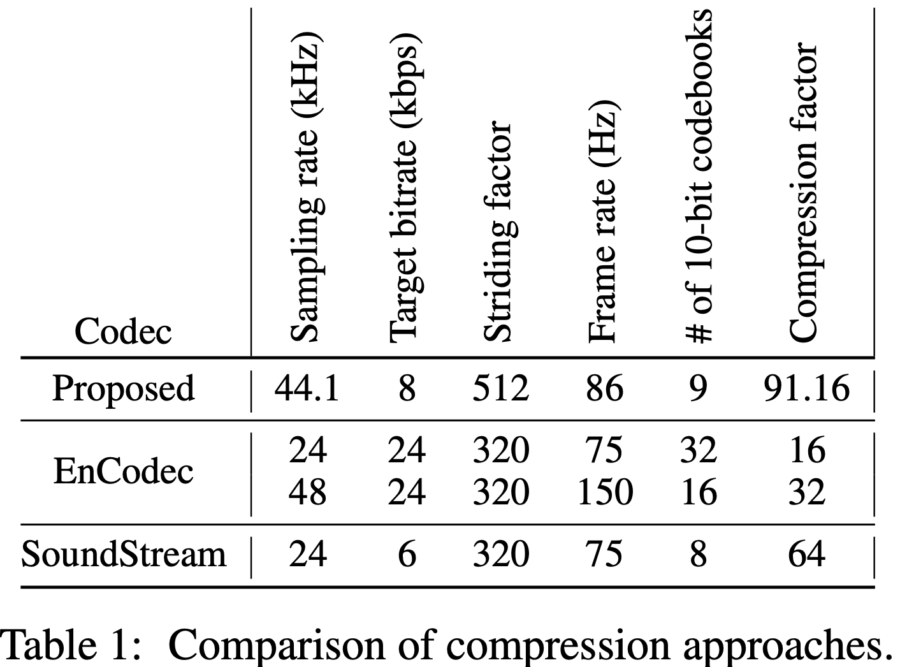
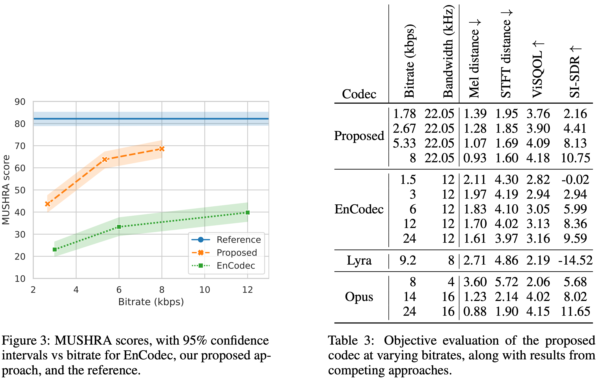

# Descript Audio Codec (.dac): High-Fidelity Audio Compression with Improved RVQGAN

This repository contains training and inference scripts
for the Descript Audio Codec (.dac), a high fidelity general
neural audio codec, introduced in the paper titled **High-Fidelity Audio Compression with Improved RVQGAN**.

 [arXiv Paper: High-Fidelity Audio Compression with Improved RVQGAN
](http://arxiv.org/abs/2306.06546) <br>
📈 [Demo Site](https://descript.notion.site/Descript-Audio-Codec-11389fce0ce2419891d6591a68f814d5)<br>
⚙ [Model Weights](https://github.com/descriptinc/descript-audio-codec/releases/download/0.0.1/weights.pth)

👉 With Descript Audio Codec, you can compress **44.1 KHz audio** into discrete codes at a **low 8 kbps bitrate**.  <br>
🤌 That's approximately **90x compression** while maintaining exceptional fidelity and minimizing artifacts.  <br>
💪 Our universal model works on all domains (speech, environment, music, etc.), making it widely applicable to generative modeling of all audio.  <br>
👌 It can be used as a drop-in replacement for EnCodec for all audio language modeling applications (such as AudioLMs, MusicLMs, MusicGen, etc.) <br>

<p align="center">
</p>


## Usage

### Installation
```
pip install descript-audio-codec
```
OR

```
pip install git+https://github.com/descriptinc/descript-audio-codec
```

### Weights
Weights are released as part of this repo under MIT license.
They are automatically downloaded when you first run `encode` or `decode` command. They can be cached locally with
```
python3 -m dac download
```
We provide a Dockerfile that installs all required dependencies for encoding and decoding. The build process caches model weights inside the image. This allows the image to be used without an internet connection. [Please refer to instructions below.](#docker-image)


### Compress audio
```
python3 -m dac encode /path/to/input --output /path/to/output/codes
```

This command will create `.dac` files with the same name as the input files.
It will also preserve the directory structure relative to input root and
re-create it in the output directory. Please use `python -m dac encode --help`
for more options.

### Reconstruct audio from compressed codes
```
python3 -m dac decode /path/to/output/codes --output /path/to/reconstructed_input
```

This command will create `.wav` files with the same name as the input files.
It will also preserve the directory structure relative to input root and
re-create it in the output directory. Please use `python -m dac decode --help`
for more options.

### Programmatic Usage
```py
import dac
from dac.utils import load_model
from dac.model import DAC

from dac.utils.encode import process as encode
from dac.utils.decode import process as decode

from audiotools import AudioSignal

# Init an empty model
model = DAC()

# Load compatible pre-trained model
model = load_model(dac.__model_version__)
model.eval()
model.to('cuda')

# Load audio signal file
signal = AudioSignal('input.wav')

# Encode audio signal
encoded_out = encode(signal, 'cuda', model)

# Decode audio signal
recon = decode(encoded_out, 'cuda', model, preserve_sample_rate=True)

# Write to file
recon.write('recon.wav')
```

### Docker image
We provide a dockerfile to build a docker image with all the necessary
dependencies.
1. Building the image.
    ```
    docker build -t dac .
    ```
2. Using the image.

    Usage on CPU:
    ```
    docker run dac <command>
    ```

    Usage on GPU:
    ```
    docker run --gpus=all dac <command>
    ```

    `<command>` can be one of the compression and reconstruction commands listed
    above. For example, if you want to run compression,

    ```
    docker run --gpus=all dac python3 -m dac encode ...
    ```


## Training
The baseline model configuration can be trained using the following commands.

### Pre-requisites
Please install the correct dependencies
```
pip install -e ".[dev]"
```


### Single GPU training
```
export CUDA_VISIBLE_DEVICES=0
python scripts/train.py --args.load conf/ablations/baseline.yml --save_path runs/baseline/
```

### Multi GPU training
```
export CUDA_VISIBLE_DEVICES=0,1
torchrun --nproc_per_node gpu scripts/train.py --args.load conf/ablations/baseline.yml --save_path runs/baseline/
```

## Testing
We provide two test scripts to test CLI + training functionality. Please
make sure that the trainig pre-requisites are satisfied before launching these
tests. To launch these tests please run
```
python -m pytest tests
```

## Results

<p align="left">
</p>
